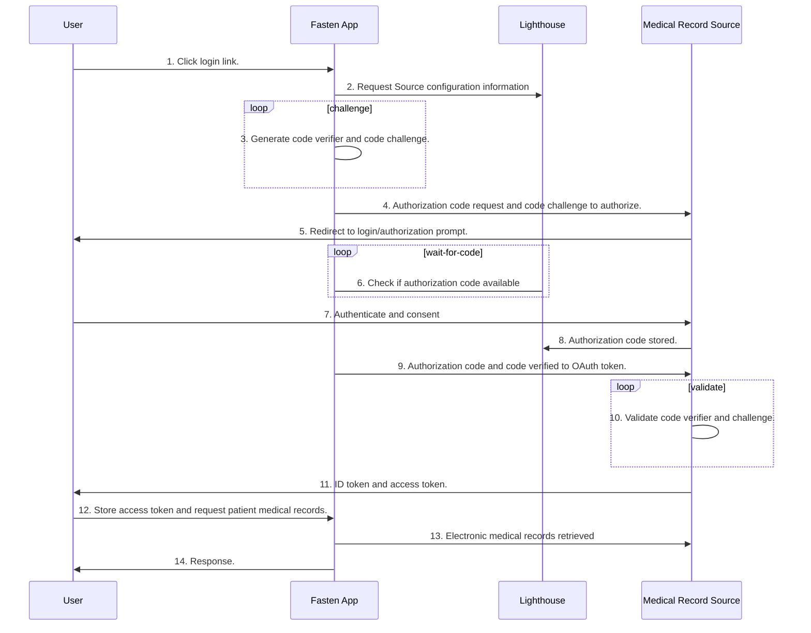

> The PKCE authorization code flow adds a secret (a `code_verifier` generated using SHA-256) created by the client application that is verified by the authorization server. The client application creates a transform value (hash string) of the `code_verifier` called the `code_challenge` which is sent using HTTPS to retrieve an authorization code. A malicious attacker can intercept this code, but cannot exchange it for a token without the `code_verifier`.
> 
> https://andrewowen.net/blog/creating-diagrams-with-mermaid/

The Fasten Lighthouse acts like a man-in-the-middle, however it only temporarily stores the code 