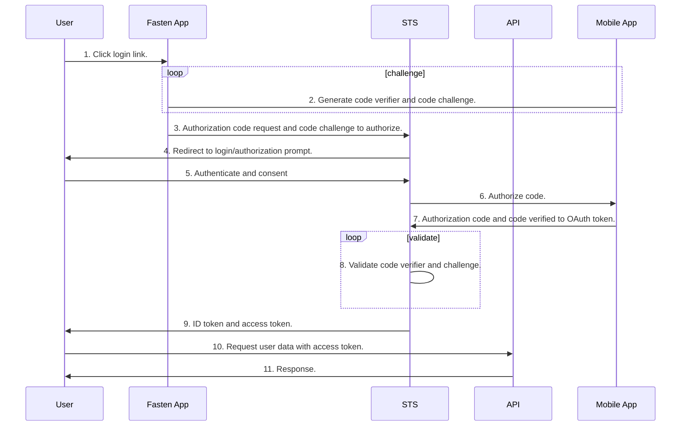

```mermaid
sequenceDiagram
    participant User
    participant Fasten App
    participant STS
    participant API
	

    User->>Fasten App: 1. Click login link.
    
    loop challenge
    Fasten App->Mobile App: 2. Generate code verifier and code challenge.
    end
    
    Fasten App->>STS: 3. Authorization code request and code challenge to authorize.
    STS->>User: 4. Redirect to login/authorization prompt.
    User->>STS: 5. Authenticate and consent
    STS->>Mobile App: 6. Authorize code.
    Mobile App->>STS: 7. Authorization code and code verified to OAuth token.
    
    loop validate
    STS->STS: 8. Validate code verifier and challenge.
    end
    
    STS->>User: 9. ID token and access token.
    User->>API: 10. Request user data with access token.
    API->>User: 11. Response.

```
