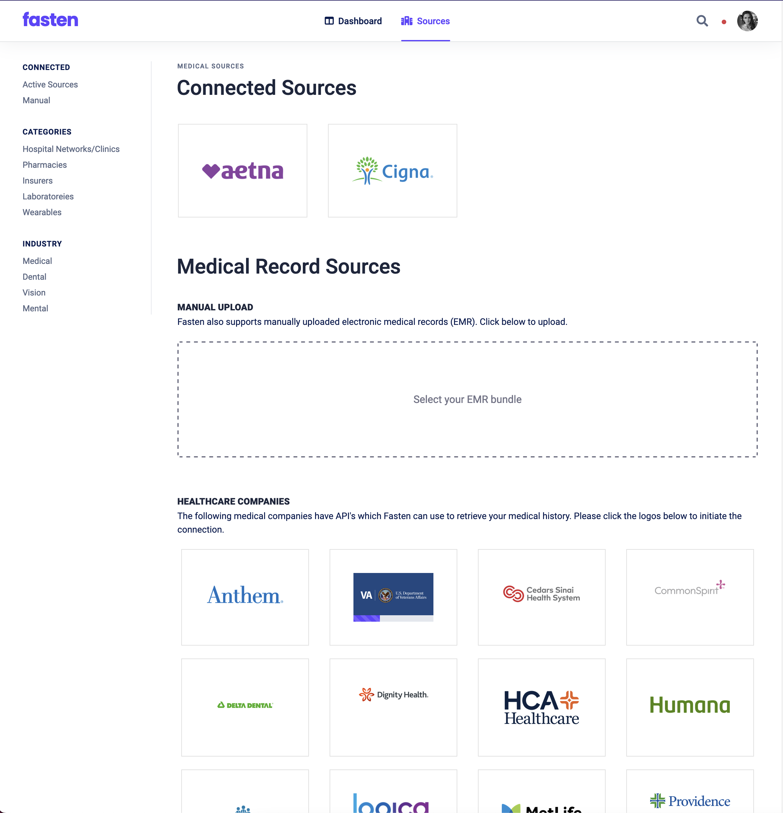

# docs

> From my [Reddit post announcing Fasten](https://www.reddit.com/r/selfhosted/comments/xj9rx7/introducing_fasten_a_selfhosted_personal/)

Like many of you, I've worked for many companies over my career. 
In that time, I've had multiple health, vision and dental insurance providers, and visited many different clinics, hospitals and labs to get procedures & tests done.

Recently I had a semi-serious medical issue, and I realized that my medical history (and the medical history of my family members) 
is a lot more complicated than I realized and distributed across the many healthcare providers I've used over the years. 
I wanted a single (private) location to store our medical records, and I just couldn't find any software that worked as I'd like:

- self-hosted/offline - this is my medical history, I'm not willing to give it to some random multi-national corporation to data-mine and sell
- It should aggregate my data from multiple healthcare providers (insurance companies, hospital networks, clinics, labs) across multiple industries (vision, dental, medical) -- all in one dashboard
- automatic - it should pull my EMR (electronic medical record) directly from my insurance provider/clinic/hospital network - I don't want to scan/OCR physical documents (unless I have to)
- open source - the code should be available for contributions & auditing

So, I built it

**Fasten is open-source, self-hosted, personal/family electronic medical record aggregator, designed to integrate with 1000's of insurances/hospitals/clinics**

**Fasten creates a secure, connected personal health record that never leaves your hands**

Here's a couple of screenshots that'll give you an idea of what it looks like:

[Fasten Screenshots](https://imgur.com/a/vfgojBD)

It's pretty basic right now, but it's designed with a easily extensible core around a solid foundation:

- Self-hosted
- Designed for families, not Clinics (unlike OpenEMR and other popular EMR systems)
- Supports the Medical industry's (semi-standard) FHIR protocol 
- Uses OAuth2 (Smart-on-FHIR) authentication (no passwords necessary)
- Uses OAuth's `offline_access` scope (where possible) to automatically pull changes/updates
- Multi-user support for household/family use
- (Future) Dashboards & tracking for diagnostic tests
- (Future) Integration with smart-devices & wearables

---

See [FAQs](./FAQs.md) for common questions (& answers) regarding Fasten

---

**This is where you come in. I need feedback, lots of it.**

I created a Google Form, and I'd appreciate it if you all filled it out and gave me some indication if this is worthwhile and what kind of monetization model we should follow. 

[https://forms.gle/HqxLL23jxRWvZLKY6](https://forms.gle/HqxLL23jxRWvZLKY6)

Thanks!!

---

# Targeted Features
> See [FEATURES](FEATURES.md)
- Integrate with popular health portals
- Track events (calendar)?
- Upload photo records
- Authentication required
- Encryption at rest
- Integration with external apis 
	- (Apple Health?) 
	- [https://www.researchandcare.org/carekit/](https://www.researchandcare.org/carekit/)
	- smart scales
- Integration with DNA suites
- Historical data from lab results (bloodwork over time)
- Import via forwarded emails
- Features:   [https://github.com/carekit-apple/CareKit/tree/master/OCKSample](https://github.com/carekit-apple/CareKit/tree/master/OCKSample)
- [https://awesomeopensource.com/project/carekit-apple/CareKit](https://awesomeopensource.com/project/carekit-apple/CareKit)
- [https://docs.smarthealthit.org/](https://docs.smarthealthit.org/)
- Vaccine records
- Family history

| Data Sources                    | Data Elements                      | Insurance Types |
|---------------------------------|------------------------------------|-----------------|
| Electronic Health Records (EHR) | Explanation of benefits            | Dental          |
| Patient Portals                 | Genotypes & genetic traits         | Vision          |
| Health Systems                  | Activity                           | Medical         |
| Hospitals & Doctors             | Sleep                              | Travel          |
| Pharmacies                      | Meals                              | Prescription    |
| Wearable Devices                | Healthcare claims                  | Telemedicine    |
| Health Insurers                 | Immunizations (vaccination status) | Mental Health   |
| Laboratories                    | Plans of care                      | Gap             |
|                                 | Narratives                         | Short Term      |
|                                 | Conditions                         | Hearing         |

