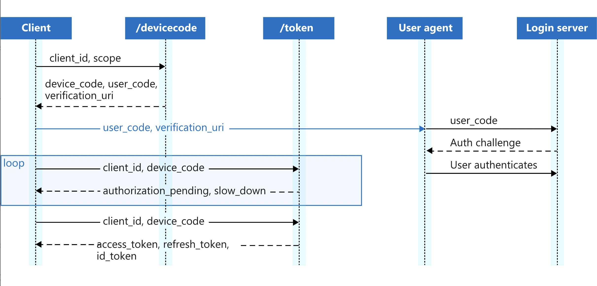

# docs

# Features
- Integrate with popular health portals
- Track events (calendar)?
- Upload photo records
- Authentication required
- Encryption at rest
- Integration with external apis 
	- (Apple Health?) 
	- [https://www.researchandcare.org/carekit/](https://www.researchandcare.org/carekit/)
	- smart scales
- Integration with DNA suites
- Historical data from lab results (bloodwork over time)
- Forward emails
- Features:   [https://github.com/carekit-apple/CareKit/tree/master/OCKSample](https://github.com/carekit-apple/CareKit/tree/master/OCKSample)
- [https://awesomeopensource.com/project/carekit-apple/CareKit](https://awesomeopensource.com/project/carekit-apple/CareKit)
- [https://docs.smarthealthit.org/](https://docs.smarthealthit.org/)
- Vaccine records
- Family history

# Regulations
- 21st Century Cures Act’s Interoperability
- Patient Access Final Rule (CMS-9115-F)
- https://www.cms.gov/Regulations-and-Guidance/Guidance/Interoperability/index

# FHIR

### Data Sources
- Electronic Health Records (EHR)
- Patient Portals
- Health Systems
- Hospitals & Doctors
- Pharmacies
- Wearable Devices
- Health Insurers
- Laboratories

### Data Elements
- Explanation of benefits
- Genotypes & genetic traits
- Activity
- Sleep
- Meals
- Healthcare claims
- Immunizations (vaccination status)
- Plans of care
- Narratives
- Conditions
- Medications
- Procedures
- Encounters
- Test results
- Demographics
- Social history
- Vitals/observations
- Organizations

### Insurance Types
- Dental
- Vision
- Medical
- Travel
- Prescription
- Telemedicine
- Mental Health
- Gap
- Short Term
- Hearing
- Disability
- Accident
- Long Term Care
-  Income Protection

## Medical Sources
- [https://github.com/flexpa/sero/issues/78](https://github.com/flexpa/sero/issues/78)

| **Medical Testing Companies** | Status |
| --- | --- |
| Quest Diagnostics	| |
| Labcorp | |	
| Abbott Laboratories | |	
| Siemens Healthineers	| |
| Danaher | |		
| Becton Dickinson | |		
| Bio-Reference Laboratories, Inc. | |		
| bioMérieux | |		
| Spectra Laboratories, Inc. | |		
| Charles River Laboratories | |		
| ARUP Laboratories | |		
| Sonic Healthcare Ltd | |		
| Genomic Health | |		
| NeoGenomics | |		
| Alere Inc. | |		
| CareDx, Inc | |		
| EXACT Sciences Corporation | |		
| Fulgent Genetics	 | |	
| F2 Labs | |		
| Clarient, Inc. | |		
| Genoptix Medical Laboratory | |		
| Sanofi	 | |	
| DaVita | |		
| Myriad Genetics | |		

| **Health Insurance Companies** | Status | Version |
| --- | --- | --- |
| Humana | |
| UnitedHealth Group | |
| Anthem | |
| Cigna | Sandbox account | HL7 - FHIR 4.0.1 |
| Kaiser Permanente | Account created |
| Molina Healthcare | |
| Golden Rule Insurance Company | |
| [Aetna](https://developerportal.aetna.com/managedcontent/pdfs/Aetna_DeveloperPortal_Handbook_Sandbox.pdf)) [1](https://developerportal.aetna.com/gettingstarted) | BETA - no dev access | v3.1.1: STU 3/ CARIN Blue Button Implementation Guide (v1.0.0)
| Centene Corporation | |
| Blue Cross Blue Shield Association | |
| HealthPartners | |
| CVS Health Corporation | |
| Highmark | |
| HCSC | |
| Premera Blue Cross | |
| Blue Shield of California | |
| WellCare Health Plans | |
| Independence Blue Cross | |
| Medical Mutual of Ohio | |
| Horizon Blue Cross Blue Shield of New Jersey | |
| UnitedHealthcare Insurance Co | |
| BlueCross BlueShield of South Carolina | |
| Mutual of Omaha Insurance Company | |
| EmblemHealth | |

## Authentication/OAuth
- https://build.fhir.org/ig/HL7/smart-app-launch/scopes-and-launch-context.html
- [https://usefulangle.com/post/4/javascript-communication-parent-child-window](https://usefulangle.com/post/4/javascript-communication-parent-child-window)
- [https://build.fhir.org/ig/HL7/smart-app-launch/app-launch.html](https://build.fhir.org/ig/HL7/smart-app-launch/app-launch.html)
- [https://auth0.com/docs/flows/concepts/auth-code-pkce](https://auth0.com/docs/flows/concepts/auth-code-pkce)
- [https://build.fhir.org/ig/HL7/smart-app-launch/example-app-launch-public.html#step-5-access-token](https://build.fhir.org/ig/HL7/smart-app-launch/example-app-launch-public.html#step-5-access-token)
- 

## Schemas
- [https://schema.org/MedicalEntity](https://schema.org/MedicalEntity)
- [https://www.hl7.org/fhir/overview.html](https://www.hl7.org/fhir/overview.html)
- [https://www.hl7.org/fhir/patient-operation-everything.html](https://www.hl7.org/fhir/patient-operation-everything.html)
- [https://reference.humanapi.co/reference/allergies](https://reference.humanapi.co/reference/allergies)
- [https://fhir.epic.com/Documentation?docId=patientfacingfhirapps](https://fhir.epic.com/Documentation?docId=patientfacingfhirapps)
- [https://docs.microsoft.com/en-us/azure/healthcare-apis/fhir/patient-everything](https://docs.microsoft.com/en-us/azure/healthcare-apis/fhir/patient-everything)
- [https://cloud.google.com/healthcare-api/docs/how-tos/fhir-bundles](https://cloud.google.com/healthcare-api/docs/how-tos/fhir-bundles)
- [https://www.hl7.org/fhir/definitions.json.zip](https://www.hl7.org/fhir/definitions.json.zip)
- https://docs.sero.run/book/build/patient-access
- https://open.epic.com/Interface/FHIR
- http://clinfhir.com/

## Example Datasets
- [https://synthetichealth.github.io/synthea/](https://synthetichealth.github.io/synthea/)
- [http://docs.smarthealthit.org/dstu2-examples/](http://docs.smarthealthit.org/dstu2-examples/)
- [https://github.com/hapifhir/fhir-tutorial/blob/master/Transactions/lesson.md](https://github.com/hapifhir/fhir-tutorial/blob/master/Transactions/lesson.md)

## SMART/FHIR - Healthcare Applications Directories
- https://apps.smarthealthit.org/apps/designed_for/patients?sort=name-asc
- https://github.com/the-commons-project
- [https://vci.org/](https://vci.org/)
- [https://bluebutton.cms.gov/](https://bluebutton.cms.gov/)
- [https://onerecord.com/](https://onerecord.com/)
- https://github.com/MIT-LCP/mimic-code
- https://appmarket.epic.com/
- http://clinfhir.com/packageViewer.html

## Map between versions
- https://github.com/ahdis/fhir-mapping-tutorial
- https://confluence.hl7.org/display/FHIR/Using+the+FHIR+Mapping+Language
- https://github.com/microsoft/fhir-server/blob/main/docs/ConvertDataOperation.md
- https://github.com/microsoft/FHIR-Converter/
- 

# Application

## Javascript 
- [https://github.com/smart-on-fhir/client-js](https://github.com/smart-on-fhir/client-js)
- 

## Golang
- Workers - https://github.com/gocraft/work
- Role based authentication - [https://github.com/Permify/permify-gorm](https://github.com/Permify/permify-gorm)
- https://github.com/google/fhir
- [https://github.com/flexpa/awesome-fhir](https://github.com/flexpa/awesome-fhir)
- 

## Database
- Sqlite
- BerkerleyDB
- LevelDB / RocksDB are more modern, maintained, better for SSD workload

## Themes
- [https://zylon-ng.envytheme.com/](https://zylon-ng.envytheme.com/)
- [https://preview.themeforest.net/item/zylon-angular-research-laboratory-template/full_screen_preview/29014781](https://preview.themeforest.net/item/zylon-angular-research-laboratory-template/full_screen_preview/29014781)
- [https://topli-ng.envytheme.com/home-three](https://topli-ng.envytheme.com/home-three)
- [https://preview.themeforest.net/item/topli-angular-loans-funding-agency-template/full_screen_preview/28317475](https://preview.themeforest.net/item/topli-angular-loans-funding-agency-template/full_screen_preview/28317475)
- [https://themepure.net/template/medidove-prv/medidove/index-2.html](https://themepure.net/template/medidove-prv/medidove/index-2.html)
- [https://preview.themeforest.net/item/medidove-medical-and-health-html5-template/full_screen_preview/23429465](https://preview.themeforest.net/item/medidove-medical-and-health-html5-template/full_screen_preview/23429465)
- [https://github.com/themefisher/novena](https://github.com/themefisher/novena)
- [https://themeforest.net/item/tinzer-telemedicine-telehealth-services-template/27539473](https://themeforest.net/item/tinzer-telemedicine-telehealth-services-template/27539473)
- https://windmill-dashboard.vercel.app/tables.html
- https://akveo.github.io/ngx-admin/

## Marketing Website
### Icons
- [https://thenounproject.com/icon/electronic-health-record-3989976/](https://thenounproject.com/icon/electronic-health-record-3989976/)
- [https://thenounproject.com/icon/mobile-ehr-3989867/](https://thenounproject.com/icon/mobile-ehr-3989867/)
- [https://thenounproject.com/icon/medical-record-2082004/](https://thenounproject.com/icon/medical-record-2082004/)
- [https://thenounproject.com/icon/medical-record-1527328/](https://thenounproject.com/icon/medical-record-1527328/)
- [https://thenounproject.com/icon/medical-records-1983987/](https://thenounproject.com/icon/medical-records-1983987/)
- [https://thenounproject.com/icon/medical-record-4996256/](https://thenounproject.com/icon/medical-record-4996256/)
- [https://thenounproject.com/icon/medical-record-1880471/](https://thenounproject.com/icon/medical-record-1880471/)
- [https://thenounproject.com/icon/medical-record-2112034/](https://thenounproject.com/icon/medical-record-2112034/)
- [https://thenounproject.com/icon/medical-3518236/](https://thenounproject.com/icon/medical-3518236/)
- [https://thenounproject.com/icon/medical-3518067/](https://thenounproject.com/icon/medical-3518067/)
- [https://thenounproject.com/icon/safety-pin-69844/](https://thenounproject.com/icon/safety-pin-69844/)
- [https://thenounproject.com/icon/safety-pin-69848/](https://thenounproject.com/icon/safety-pin-69848/)
- [https://thenounproject.com/icon/safety-pin-73186/](https://thenounproject.com/icon/safety-pin-73186/)
- [https://thenounproject.com/icon/safety-pin-73195/](https://thenounproject.com/icon/safety-pin-73195/)
- [https://thenounproject.com/icon/safety-pins-2054141/](https://thenounproject.com/icon/safety-pins-2054141/)
- [https://thenounproject.com/icon/safety-pin-5036400/](https://thenounproject.com/icon/safety-pin-5036400/)
- [https://thenounproject.com/icon/safety-pin-4521866/](https://thenounproject.com/icon/safety-pin-4521866/)
- [https://thenounproject.com/icon/medical-security-4228165/](https://thenounproject.com/icon/medical-security-4228165/)

### Main Photo
-   [https://unsplash.com/photos/REKXJ7JhwiI](https://unsplash.com/photos/REKXJ7JhwiI)
-   [https://unsplash.com/photos/MpItbN6K398](https://unsplash.com/photos/MpItbN6K398)
-   [https://unsplash.com/photos/TnBpsxXPfpM](https://unsplash.com/photos/TnBpsxXPfpM)
-   [https://unsplash.com/photos/oUhSla4L_98](https://unsplash.com/photos/oUhSla4L_98)
-   [https://unsplash.com/photos/mNGaaLeWEp0](https://unsplash.com/photos/mNGaaLeWEp0)
-   [https://unsplash.com/photos/wBgAVAGjzFg](https://unsplash.com/photos/wBgAVAGjzFg)
-   [https://unsplash.com/photos/7edWO30e32k](https://unsplash.com/photos/7edWO30e32k)