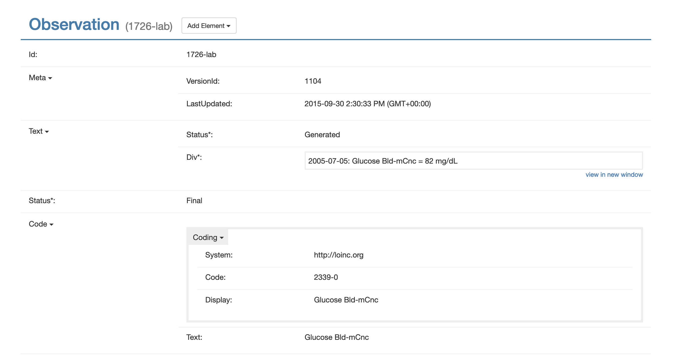

# docs

# Features
- Integrate with popular health portals
- Track events (calendar)?
- Upload photo records
- Authentication required
- Encryption at rest
- Integration with external apis 
	- (Apple Health?) 
	- [https://www.researchandcare.org/carekit/](https://www.researchandcare.org/carekit/)
	- smart scales
- Integration with DNA suites
- Historical data from lab results (bloodwork over time)
- Forward emails
- Features:   [https://github.com/carekit-apple/CareKit/tree/master/OCKSample](https://github.com/carekit-apple/CareKit/tree/master/OCKSample)
- [https://awesomeopensource.com/project/carekit-apple/CareKit](https://awesomeopensource.com/project/carekit-apple/CareKit)
- [https://docs.smarthealthit.org/](https://docs.smarthealthit.org/)
- Vaccine records
- Family history

# Regulations
- 21st Century Cures Act’s Interoperability
- Patient Access Final Rule (CMS-9115-F)
- https://www.cms.gov/Regulations-and-Guidance/Guidance/Interoperability/index
- Trusted Health Data Exchange Framework
	- https://ehrintelligence.com/features/hies-eager-to-join-ambitious-onc-health-data-exchange-framework
- https://www.cms.gov/files/document/faqs-interoperability-patient-access-and-cop-event-notifications-may-2021.pdf
- https://www.cms.gov/files/document/cms-9115-f.pdf
- https://confluence.hl7.org/display/DVP/Da+Vinci+Implementer+Support
- https://www.cmspatientaccessrule.com/
- https://data.cms.gov/provider-compliance
- https://confluence.hl7.org/display/DVP/Da+Vinci+Implementer+Support
- https://www.cmscompliancetracker.com/?page_id=89
- 

### Data Sources
- Electronic Health Records (EHR)
- Patient Portals
- Health Systems
- Hospitals & Doctors
- Pharmacies
- Wearable Devices
- Health Insurers
- Laboratories

### Data Elements
- Explanation of benefits
- Genotypes & genetic traits
- Activity
- Sleep
- Meals
- Healthcare claims
- Immunizations (vaccination status)
- Plans of care
- Narratives
- Conditions
- Medications
- Procedures
- Encounters
- Test results
- Demographics
- Social history
- Vitals/observations
- Organizations

### Insurance Types
- Dental
- Vision
- Medical
- Travel
- Prescription
- Telemedicine
- Mental Health
- Gap
- Short Term
- Hearing
- Disability
- Accident
- Long Term Care
-  Income Protection

# FHIR

## Medical Sources
- [https://github.com/flexpa/sero/issues/78](https://github.com/flexpa/sero/issues/78)

https://www.cmscompliancetracker.com/?page_id=89

https://www.cmscompliancetracker.com/

## Schemas
- [https://schema.org/MedicalEntity](https://schema.org/MedicalEntity)
- [https://www.hl7.org/fhir/overview.html](https://www.hl7.org/fhir/overview.html)
- [https://www.hl7.org/fhir/patient-operation-everything.html](https://www.hl7.org/fhir/patient-operation-everything.html)
- [https://reference.humanapi.co/reference/allergies](https://reference.humanapi.co/reference/allergies)
- [https://fhir.epic.com/Documentation?docId=patientfacingfhirapps](https://fhir.epic.com/Documentation?docId=patientfacingfhirapps)
- [https://docs.microsoft.com/en-us/azure/healthcare-apis/fhir/patient-everything](https://docs.microsoft.com/en-us/azure/healthcare-apis/fhir/patient-everything)
- [https://cloud.google.com/healthcare-api/docs/how-tos/fhir-bundles](https://cloud.google.com/healthcare-api/docs/how-tos/fhir-bundles)
- [https://www.hl7.org/fhir/definitions.json.zip](https://www.hl7.org/fhir/definitions.json.zip)
- https://docs.sero.run/book/build/patient-access
- https://open.epic.com/Interface/FHIR
- http://clinfhir.com/
- https://fhirbase.aidbox.app/schema - basically store the full json resource in a field
- https://docs.aws.amazon.com/healthlake/latest/devguide/supported-resources.html

> About 33% of respondents favored Epic, whereas 18% decided to renovate their contract with Cerner, and only 7% decided to renovate their contract with Athena Health. This research shows that not all hospitals use Epic; many hospitals also opt for their closest competitors- Cerner, Athena Health and Folio3,
 

## Bulk Data
- https://hl7.org/fhir/uv/bulkdata/

Mandatory Elements
- http://hl7.org/fhir/us/core/StructureDefinition-us-core-patient.html

## Map between versions
- https://github.com/ahdis/fhir-mapping-tutorial
- https://confluence.hl7.org/display/FHIR/Using+the+FHIR+Mapping+Language
- https://github.com/microsoft/fhir-server/blob/main/docs/ConvertDataOperation.md
- https://github.com/microsoft/FHIR-Converter/

# Application
## UX
- https://github.com/smart-on-fhir/patient-browser - REACT
- https://patient-browser.smarthealthit.org/index.html#/ 
- Resource viewer - http://docs.smarthealthit.org/fred/?resource=.%2Fsamples%2Fbundle.json
- 
- https://github.com/healthintellect/fhir-ui - REACT
- https://github.com/openmrs/openmrs-esm-patient-chart
- https://github.com/smart-on-fhir/fhir-server-dashboard
- https://github.com/henryzt/GOSH-FHIRworks2020-React-Dashboard
- https://github.com/looker-open-source/healthcare_demo
- https://github.com/1uphealth/fhir-react
	- http://storybook-fhir-react-lib.s3-website-us-east-1.amazonaws.com/?path=/story/practitioner--example-3-of-r-4
- https://github.com/synthetichealth/fhir-visualizers/blob/master/src/index.js
- 

## ADMIN Dashboard
- https://github.com/smart-on-fhir/fhir-server-dashboard
- 

## Themes

- https://patient-browser.smarthealthit.org/index.html#/

https://github.com/Open-Health-Manager/standard-patient-health-record-ig
https://open-health-manager.github.io/standard-patient-health-record-ig/
