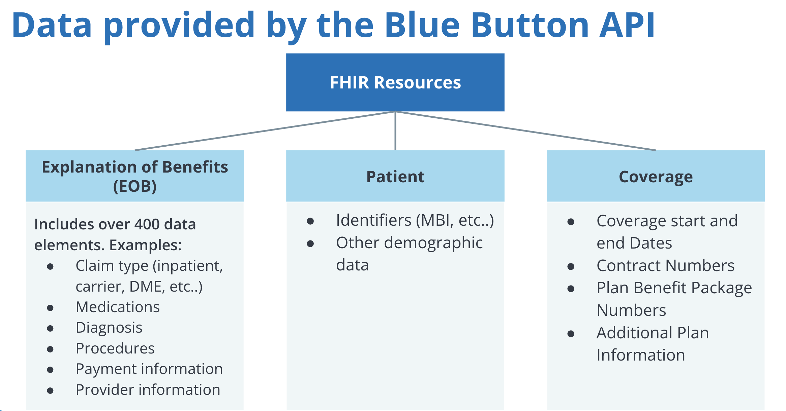

# Regulations
- 21st Century Cures Act’s Interoperability
- Patient Access Final Rule (CMS-9115-F)
- https://www.cms.gov/Regulations-and-Guidance/Guidance/Interoperability/index
- Trusted Health Data Exchange Framework
	- https://ehrintelligence.com/features/hies-eager-to-join-ambitious-onc-health-data-exchange-framework
- https://www.cms.gov/files/document/faqs-interoperability-patient-access-and-cop-event-notifications-may-2021.pdf
- https://www.cms.gov/files/document/cms-9115-f.pdf
- https://confluence.hl7.org/display/DVP/Da+Vinci+Implementer+Support
- https://www.cmspatientaccessrule.com/
- https://data.cms.gov/provider-compliance
- https://confluence.hl7.org/display/DVP/Da+Vinci+Implementer+Support
- https://www.cmscompliancetracker.com/?page_id=89
- 

# FHIR

## Schemas
- [https://schema.org/MedicalEntity](https://schema.org/MedicalEntity)
- [https://www.hl7.org/fhir/overview.html](https://www.hl7.org/fhir/overview.html)
- [https://www.hl7.org/fhir/patient-operation-everything.html](https://www.hl7.org/fhir/patient-operation-everything.html)
- [https://reference.humanapi.co/reference/allergies](https://reference.humanapi.co/reference/allergies)
- [https://fhir.epic.com/Documentation?docId=patientfacingfhirapps](https://fhir.epic.com/Documentation?docId=patientfacingfhirapps)
- [https://docs.microsoft.com/en-us/azure/healthcare-apis/fhir/patient-everything](https://docs.microsoft.com/en-us/azure/healthcare-apis/fhir/patient-everything)
- [https://cloud.google.com/healthcare-api/docs/how-tos/fhir-bundles](https://cloud.google.com/healthcare-api/docs/how-tos/fhir-bundles)
- [https://www.hl7.org/fhir/definitions.json.zip](https://www.hl7.org/fhir/definitions.json.zip)
- https://docs.sero.run/book/build/patient-access
- https://open.epic.com/Interface/FHIR
- http://clinfhir.com/
- https://fhirbase.aidbox.app/schema - basically store the full json resource in a field
- https://docs.aws.amazon.com/healthlake/latest/devguide/supported-resources.html

> About 33% of respondents favored Epic, whereas 18% decided to renovate their contract with Cerner, and only 7% decided to renovate their contract with Athena Health. This research shows that not all hospitals use Epic; many hospitals also opt for their closest competitors- Cerner, Athena Health and Folio3,
 

## Bulk Data
- https://hl7.org/fhir/uv/bulkdata/

Mandatory Elements
- http://hl7.org/fhir/us/core/StructureDefinition-us-core-patient.html

## Map between versions
- https://github.com/ahdis/fhir-mapping-tutorial
- https://confluence.hl7.org/display/FHIR/Using+the+FHIR+Mapping+Language
- https://github.com/microsoft/fhir-server/blob/main/docs/ConvertDataOperation.md
- https://github.com/microsoft/FHIR-Converter/

- Plaid for health care
	- https://www.humanapi.co/

https://www.humanapi.co/clinical-data-network?utm_content=207034898&utm_medium=social&utm_source=twitter&hss_channel=tw-826261561

https://www.humanapi.co/clinical-data-network

https://www.reddit.com/r/medicalschool/comments/9lc1rf/im_a_physician_at_stanford_university_and_a/?utm_source=share&utm_medium=ios_app&utm_name=iossmf

Lighthouse

GitHub timeline
Encryption at rest
User accounts

https://hbr.org/2022/03/standardized-apis-could-finally-make-it-easy-to-exchange-health-records

A few examples:
* The CARIN Alliance (Creating Access to Realtime Information Now) focuses on consumers’ access to and control of their health information.
* CodeX is addressing the needs of cancer research, such as conducting clinical trials using “real-world data” gathered from EHRs, and matching patients with clinical trials.
* Da Vinci’s efforts focus on interactions between health care providers and health plans: prior authorization, confirming a patient’s health insurance coverage, and accessing information about the price of care.
* Helios, formed in fall 2021, is focusing on public health use cases, including reporting the incidence of diseases such as Covid-19, influenza, and sexually transmitted disease.

https://www.hl7.org/about/fhir-accelerator/

https://www.chcf.org/program/chcf-innovation-fund/

https://www2.ccwdata.org/documents/10280/19002256/medicare-claims-maturity.pdf

https://twitter.com/search?q=Argonaut%20FHIR&src=typed_query&f=live

Argonaut & FHIR - search terms

https://digital.ahrq.gov/ahrq-funded-projects/search?search=personal+health+record&sort_by=field_fp_dates&sort_order=DESC

# hipaa policies

# HIPAA compliance
https://news.ycombinator.com/item?id=8347418

- 
