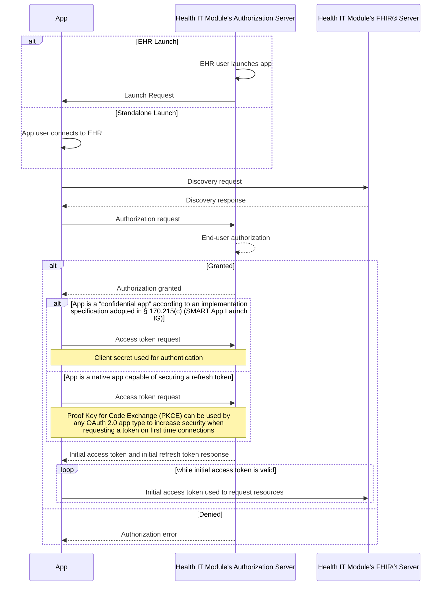

## Helpful Links

- [ONC HealthIT - 170.315(g)(10) - Standardized API for Patient and Population Services](https://www.healthit.gov/test-method/standardized-api-patient-and-population-services)
- [ONC Health App Use Scenarios & HIPAA](https://www.hhs.gov/sites/default/files/ocr-health-app-developer-scenarios-2-2016.pdf)
- [HTI-1 Final Rule](https://www.federalregister.gov/documents/2024/01/09/2023-28857/health-data-technology-and-interoperability-certification-program-updates-algorithm-transparency-and#p-1250)
	- [ONC HTI-1 Final Rule Overview](https://www.healthit.gov/sites/default/files/page/2024-01/HTI-1%20Final%20Rule%20Overview_Webinar_508.pdf)
- [Information Blocking Exceptions](https://www.healthit.gov/sites/default/files/2024-04/IB_Exceptions_Fact_Sheet_508_0.pdf)
- <https://onc-healthit.github.io/api-resource-guide/404-conditions-maintenance/>
- <https://onc-healthit.github.io/api-resource-guide/g10-criterion/#data-response-single-patient>
- [HHS - Access Rights, Health Apps & Apis](https://www.hhs.gov/hipaa/for-professionals/privacy/guidance/access-right-health-apps-apis/index.html)
- [ONC Information Blocking Actors](https://www.healthit.gov/sites/default/files/2024-04/IB_Actors_Fact_Sheet_508_0.pdf)
- [ONC - Conditions and Maintenance of Certification](https://www.healthit.gov/sites/default/files/page2/2020-03/ConditionsofCertificationWebinar.pdf)
- 

## Which "Actors" are regulated by the Information Blocking  section of the Cures Act Final Rule?

<https://www.healthit.gov/sites/default/files/2024-04/IB_Actors_Fact_Sheet_508_0.pdf>

- Health Care Provider
	- A health care provider is a: hospital; skilled nursing facility; nursing facility; home health entity or other long term care facility; health care clinic; community mental health center; renal dialysis facility; blood center; ambulatory surgical center; emergency medical services provider; federally qualified health center; group practice; pharmacist; pharmacy; laboratory; physician; practitioner; provider operated by or under contract with the Indian Health Service or by an Indian tribe, tribal organization, or urban Indian organization; rural health clinic; covered entity under 42 U.S.C. 256b; ambulatory surgical center; therapist; and any other category of health care facility, entity, practitioner, or clinician determined appropriate by the HHS Secretary.
- Health Information Network or Health Information Exchange (HEI)
- Health IT Developer of Certified Health IT

## Do Patient Access Applications need to be HIPAA compliant?

> <https://www.hhs.gov/sites/default/files/ocr-health-app-developer-scenarios-2-2016.pdf>

| Scenario                                                                                                                                                                                                                                                                                                                                                                                                                                                                                                                        | Based on the Facts Presented in the Scenario, Is App Developer a HIPAA Business Associate?                                                                                                                                                                                                                                                                                                                                                                                                                                                                                                              |
| ------------------------------------------------------------------------------------------------------------------------------------------------------------------------------------------------------------------------------------------------------------------------------------------------------------------------------------------------------------------------------------------------------------------------------------------------------------------------------------------------------------------------------- | ------------------------------------------------------------------------------------------------------------------------------------------------------------------------------------------------------------------------------------------------------------------------------------------------------------------------------------------------------------------------------------------------------------------------------------------------------------------------------------------------------------------------------------------------------------------------------------------------------- |
| Consumer downloads a health app to her smartphone that is designed to help her manage a chronic condition. She downloads data from her doctor’s EHR through a patient portal, onto her computer and then uploads it into the app. She also adds her own information to the app.                                                                                                                                                                                                                                                 | **No. Developer is not creating, receiving, maintaining or transmitting protected health information (PHI) on behalf of a covered entity or another business associate.** Instead, the consumer obtains health information from her provider, combines it with health information she inputs, and uses the app to organize and manage that information for her own purposes. There is no indication the provider or a business associate of the provider hired the app developer to provide or facilitate this service.                                                                                 |
| Consumer downloads a health app to her smartphone that is designed to help her manage a chronic condition.Health care provider and app developer have entered into an interoperability arrangement at the consumer’s request that facilitates secure exchange of consumer information between the provider EHR and the app. The consumer populates information on the app and directs the app to transmit the information to the provider’s EHR. The consumer is able to access test results from the provider through the app. | No. Developer is not creating, receiving, maintaining ortransmitting protected health information (PHI) on behalf of a covered entity or another business associate. The interoperability arrangement alone does not create a BA relationship because the arrangement exists to facilitate access initiated by the consumer. The app developer is providing a service to the consumer, at the consumer’s request and on her behalf. The app developer is transmitting data on behalf of the consumer to and from the provider; this activity does not create a BA relationship with the covered entity. |

## Do Patient Access Apps need to sign a BAA with Providers/EHRs?

The HHS has provided the following guidance for requiring BAAs for individual access requests via a third party app.  

See [https://www.hhs.gov/hipaa/for-professionals/privacy/guidance/access-right-health-apps-apis/index.html](https://www.hhs.gov/hipaa/for-professionals/privacy/guidance/access-right-health-apps-apis/index.html)  

> The HIPAA Privacy Rule generally prohibits a covered entity from refusing to disclose ePHI to a third-party app designated by the individual if the ePHI is readily producible in the form and format used by the app.

And just beyond:  

> Q: **Does HIPAA require a covered entity or its EHR system developer to enter into a business associate agreement with an app designated by the individual in order to transmit ePHI to the app?**  
> HIPAA does not require a covered entity or its business associate (e.g., EHR system developer) to enter into a business associate agreement with an app developer that does not create, receive, maintain, or transmit ePHI on behalf of or for the benefit of the covered entity

## Can EHR Developers require separate informed consent from the Patient before allowing Application developers access?

<https://onc-healthit.github.io/api-resource-guide/g10-criterion/#first-time-authentication-authorization-for-single-patient-services>

> (v) _Authentication and authorization_—(A) _Authentication and authorization for patient and user scopes_—(1) _First time connections_—(i) Authentication and authorization must occur during the process of granting access to patient data in accordance with the implementation specification adopted in § 170.215(c) and standard adopted in § 170.215(e). (ii) Authentication and authorization must occur during the process of granting access to patient data in accordance with the implementation specification adopted in § 170.215(c) and standard adopted in § 170.215(e). (iii) A Health IT Module's authorization server must issue a refresh token for a period of no less than three months to native applications capable of securing a refresh token.

TL;DR - SMART-on-FHIR acts as authorization and authentication, with informed consent.

> SEE: **First time Authentication / Authorization for Single Patient Services: Sequence Diagram**

<https://onc-healthit.github.io/api-resource-guide/g10-criterion/#first-time-authentication-authorization-for-single-patient-services>

## Do EHR Developers need to provide a Provider/Endpoint Catalog?

https://www.ecfr.gov/current/title-45/subtitle-A/subchapter-D/part-170#p-170.404(b)(1)

> Yes, under the HTI-1 Final Rule, EHR developers are required to publish their customers' service base URL information, which includes FHIR endpoints. This is part of the new and updated standards, implementation specifications, and certification criteria for electronic health records and health information technology modules for certification through the ONC certification program.

> The API Condition and Maintenance of Certification was updated related to Service Base URLs
in order to better support patient-facing apps by requiring the use of standardized formats
for “FHIR endpoints.
- <https://www.healthit.gov/sites/default/files/page/2023-12/HTI-1_Gen-Overview_factsheet_508.pdf>

> By December 31, 2024, the health IT developer publishes the service base URLs and related organization details in a standardized FHIR® format for all Health IT Modules certified to § 170.315(g)(10) that can be used by patients to access their electronic health information.
> <https://www.healthit.gov/condition-ccg/application-programming-interfaces>

## What Developer Documentation must an EHR provide?

From [Paragraph (g)(10)(viii)(A) Documentation – minimum requirements](https://www.healthit.gov/test-method/standardized-api-patient-and-population-services)

> Technical outcome – The API(s) must include complete accompanying documentation that contains, at a minimum: 
> (_1_) API syntax, function names, required and optional parameters supported and their data types, return variables and their types/structures, exceptions and exception handling methods and their returns; 
> (_2_) The software components and configurations that would be necessary for an application to implement in order to be able to successfully interact with the API and process its response(s); and 
> (_3_) All applicable technical requirements and attributes necessary for an application to be registered with a Health IT Module’s authorization server.

From Regulation text at § 170.404(A)(2)
>(2) _Transparency conditions_—
>(i) _Complete business and technical documentation_. A Certified API Developer must publish complete business and technical documentation, including the documentation described in paragraph (a)(2)(ii) of this section, via a publicly accessible hyperlink that allows any person to directly access the information without any preconditions or additional steps. 
>(ii) _Terms and conditions_—(A) _Material information_. A Certified API Developer must publish all terms and conditions for its certified API technology, including any fees, restrictions, limitations, obligations, registration process requirements, or other similar requirements that would be: (1) Needed to develop software applications to interact with the certified API technology; (2) Needed to distribute, deploy, and enable the use of software applications in production environments that use the certified API technology; (3) Needed to use software applications, including to access, exchange, and use electronic health information by means of the certified API technology; (4) Needed to use any electronic health information obtained by means of the certified API technology; (5) Used to verify the authenticity of API Users; and (6) Used to register software applications. (B) _API fees_. Any and all fees charged by a Certified API Developer for the use of its certified API technology must be described in detailed, plain language. The description of the fees must include all material information, including but not limited to: (1) The persons or classes of persons to whom the fee applies; (2) The circumstances in which the fee applies; and (3) The amount of the fee, which for variable fees must include the specific variable(s) and methodology(ies) that will be used to calculate the fee.

## Charging Fees for Patient Access Apps would be Information Blocking

Couple more explicit examples where Fees would qualify as information blocking:

[https://www.federalregister.gov/d/2020-07419/p-1315](https://www.federalregister.gov/d/2020-07419/p-1315)  

> As discussed in the Proposed Rule in [84 FR 7481](https://www.federalregister.gov/citation/84-FR-7481) and finalized in § 170.404(a)(3)(i)(A), any **API-related fee imposed by a Certified API Developer that is not expressly permitted is prohibited.**
> ..
> 
> **(3) Any fee in connection with any services that would be essential to a developer or other person's ability to develop and commercially distribute production-ready applications that use certified API technology. These services could include, for example, access to “test environments” and other resources that an application developer would need to efficiently design and develop apps.** The services could also include access to distribution channels if they are necessary to deploy production-ready software and to production resources, such as the information needed to connect to certified API technology ( _e.g.,_ service base URLs) or the ability to dynamically register with an authorization server.

[https://www.federalregister.gov/d/2020-07419/p-1352](https://www.federalregister.gov/d/2020-07419/p-1352)

> We have finalized an approach that permits Certified API Developers to recover incremental usage costs reasonably incurred during the process of hosting certified API technology on behalf of an API Information Source, which could include fees to the API Information Source for providing and supporting patient access. However, the Certified API Developers and API Information Sources **cannot recover these costs from patients or the developers of applications that facilitate access to and receipt of patients' EHI**. Patients have already effectively paid for their EHI, either directly or through their employers, health plans, and other entities that negotiate and purchase health care items and services on their behalf.

[https://www.federalregister.gov/d/2020-07419/p-2660](https://www.federalregister.gov/d/2020-07419/p-2660)

> For example, a health care provider that charges individuals a fee in order for the individuals to receive access to their EHI via the health care provider's patient portal or another internet-based method, would not be able to benefit from this exception. Similarly, **where an individual authorizes (approves) a consumer-facing app to receive EHI on the individual's behalf, the exception would not apply** to practices where an actor charges the app or its developer a fee to access or use APIs that enable an individual's access to the individual's EHI.

## Sandbox for Testing

TODO:

## Can an EHR/Actor block access to my application if they already provide access to another similar application?

## Can EHRs block my app if it helps facilitate the transfer of patient records to other applications?

<https://www.hhs.gov/hipaa/for-professionals/privacy/guidance/access-right-health-apps-apis/index.html>

> 4. **Q: Can a covered entity refuse to disclose ePHI to an app chosen by an individual because of concerns about how the app will use or disclose the ePHI it receives?**
>
   A: No. The HIPAA Privacy Rule generally prohibits a covered entity from refusing to disclose ePHI to a third-party app designated by the individual if the ePHI is readily producible in the form and format used by the app. See 45 CFR 164.524(a)(1), (c)(2)(ii), (c)(3)(ii). The HIPAA Rules do not impose any restrictions on how an individual or the individual's designee, such as an app, may use the health information that has been disclosed pursuant to the individual's right of access. For instance, a covered entity is not permitted to deny an individual's right of access to their ePHI where the individual directs the information to a third-party app because the app will share the individual's ePHI for research or because the app does not encrypt the individual's data when at rest. In addition, as discussed in Question 1 above, the HIPAA Rules do not apply to entities that do not meet the definition of a HIPAA covered entity or business associate.

## How long can a Certified EHR take to verify my identity and application?

https://www.healthit.gov/sites/default/files/page2/2020-03/ConditionsofCertificationWebinar.pdf

This is the 5 day / 10 day rule 
https://www.ecfr.gov/current/title-45/part-170#p-170.404(b)(1)

**Authenticity Verification**
- A Certified API Developer is permitted to institute a process to verify the authenticity
of API Users so long as such process is objective and the same for all API Users and
completed within **ten business days.**

**Application Registration**
-  A Certified API Developer must register and enable all applications for production use
within **five business days** of completing its verification of an API User’s authenticity.

## What kind of Security Review can be used to delay access?
<a id="security_review"/>

<https://www.healthit.gov/faqs>

> **If an actor requires third-party applications (“apps”) to be vetted[1](https://www.healthit.gov/faqs#ref1) by them for security reasons before allowing patients to use such apps to receive EHI via API technology certified to the Standardized API certification criterion, is that practice likely to be an interference under the information blocking regulations?** 

> Yes. For API technology (i.e., a Health IT Module) to be certified to the Standardized API certification criterion (§ 170.315(g)(10)), it must incorporate a number of security requirements, including the use of OAuth2 (see, e.g., [85 FR 25741](https://www.federalregister.gov/d/2020-07419/p-1186)). In addition, the Standardized API certification criterion focuses on “read-only” responses to patient directed requests for EHI to be transmitted (see [85 FR 25742](https://www.federalregister.gov/d/2020-07419/page-25742), “C. Standardized API for Patient and Population Services”). This means there should be few, if any, security concerns about the risks posed by patient-facing apps to the disclosing actor's health IT systems (because the apps would only be permitted to receive EHI at the patient's direction from the certified API technology). Thus, for third-party applications chosen by individuals to receive their EHI from API technology certified to the Standardized API certification criterion, there would generally not be a need for “vetting” the security of the app and such vetting actions would likely be an interference ([85 FR 25815](https://www.federalregister.gov/d/2020-07419/p-1927)).
> We do note, however, that actors, such as health care providers, have the ability to conduct whatever “vetting” they deem necessary of entities (_e.g.,_ app developers) that would be their business associates under HIPAA before the entities start using or maintaining EHI on behalf of the actor. In this regard, covered entities must conduct necessary vetting in order to comply with the HIPAA Security Rule ([85 FR 25815](https://www.federalregister.gov/d/2020-07419/p-1927)).

## How can I file an Information Blocking Complaint

To submit questions or comments to ONC please use our [Inquiry Portal](https://www.healthit.gov/feedback). Anonymized versions of the § 170.404 inquires and responses that ONC has handled through this portal can be accessed on the [Health IT Feedback and Inquiry Portal: API Conditions and Maintenance of Certification at § 170.404](https://onc-healthit.github.io/api-resource-guide/inquiry-portal/404-inquiries/) page.

[Information Blocking Portal](https://inquiry.healthit.gov/support/plugins/servlet/desk/portal/6)

## How can I file a Privacy Rule Complaint

If you believe that a HIPAA-covered entity or its business associate violated your (or someone else’s) health information privacy rights or committed another violation of the Privacy, Security, or Breach Notification Rules, you may file a complaint with the Office for Civil Rights (OCR). OCR can investigate complaints against covered entities (health plans, health care clearinghouses, or health care providers that conduct certain transactions electronically) and their business associates.

<https://www.hhs.gov/hipaa/filing-a-complaint/index.html>

#### How may judgments be made electronically about denial of access under the HIPAA Privacy Rule?

<https://www.hhs.gov/hipaa/for-professionals/faq/552/how-may-judgments-be-made-electronically-about-denial-of-access-under-hipaa/index.html>

> A covered entity may decide, for example, to categorically deny access to certain types of information to which no access right exists, such as psychotherapy notes. The Privacy Rule would permit denial without review, and a case-by-case judgment would not be necessary. Similarly, the covered entity may make such a system-wide decision with respect to other types of protected health information where the Privacy Rule permits an unreviewable denial of access.
> 
> In contrast, reviewable grounds for denial of access require decisions be made on a case-by-case basis through the professional judgment of licensed health care providers. Professional judgment also would be required if individuals exercise their right to appeal a denial of access made on reviewable grounds. As computer logic cannot be a substitute for professional judgment in these cases, these types of activities cannot be carried out categorically or in an automated way. Neither could these decisions be delegated to a health information organization (HIO), unless a licensed health care professional at the HIO were assigned the task of making the access determinations.

# What about TEFCA
- https://www.jmir.org/2022/11/e41750/

-----

# Uncategorized:

- https://www.hhs.gov/about/news/2024/06/24/hhs-finalizes-rule-establishing-disincentives-health-care-providers-that-have-committed-information-blocking.html