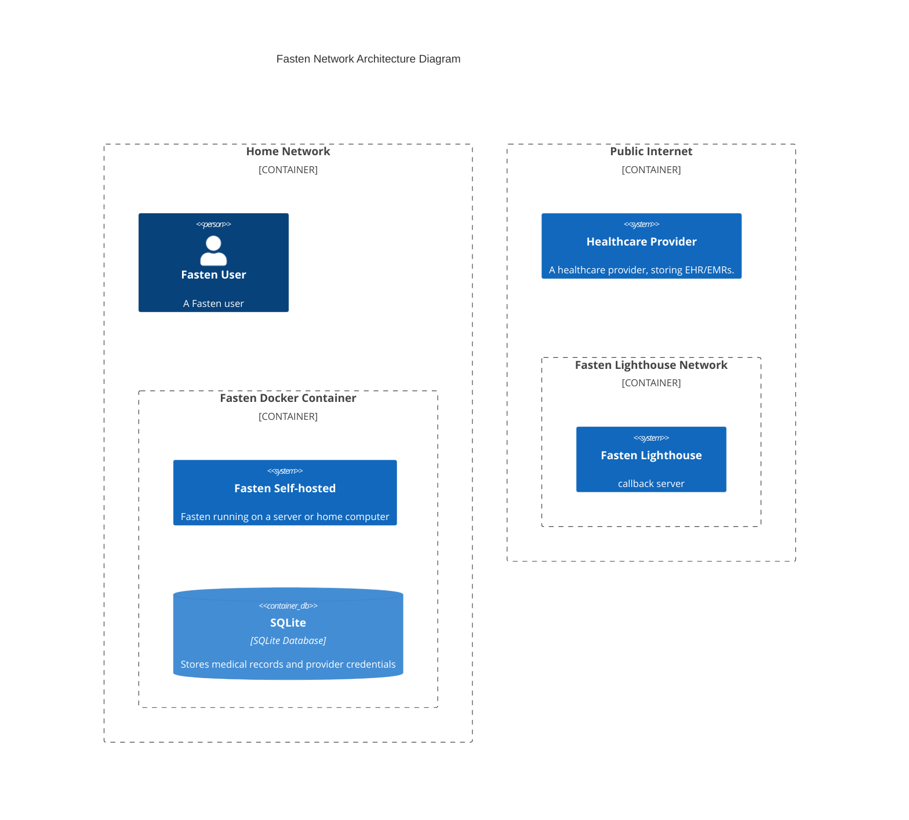
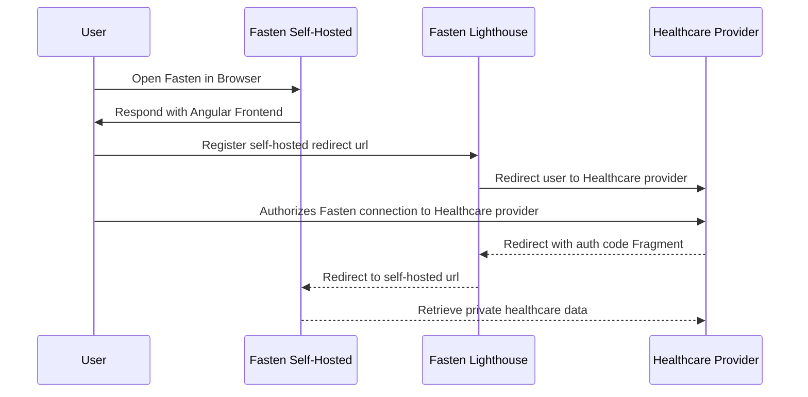

# Network Diagram

```mermaid
C4Container
title Fasten Network Architecture Diagram

Container_Boundary(homeNetwork, "Home Network") {
    Person(fastenUser, "Fasten User", "A Fasten user")
    
    Container_Boundary(dockerImage, "Fasten Docker Container") {
      System(fastenSelfhosted, "Fasten Self-hosted", "Fasten running on a server or home computer")
      ContainerDb(database, "SQLite", "SQLite Database", "Stores medical records and provider credentials")
    }
}

Container_Boundary(publicInternet, "Public Internet") {
    Container_Boundary(fastenLighthouseNetwork, "Fasten Lighthouse Network") {
      System(fastenLighthouse, "Fasten Lighthouse", "callback server")
    }
  
    System(healthCare, "Healthcare Provider", "A healthcare provider, storing EHR/EMRs.")
}


```
# Data-flow Diagram

```mermaid
sequenceDiagram
User->>Fasten Self-Hosted: Open Fasten in Browser
Fasten Self-Hosted->>User: Respond with Angular Frontend
User->>Fasten Lighthouse: Register self-hosted redirect url
Fasten Lighthouse->>Healthcare Provider: Redirect user to Healthcare provider
User->>Healthcare Provider: Authorizes Fasten connection to Healthcare provider
Healthcare Provider-->>Fasten Lighthouse: Redirect with auth code Fragment
Fasten Lighthouse-->>Fasten Self-Hosted: Redirect to self-hosted url 
Fasten Self-Hosted-->>Healthcare Provider:Retrieve private healthcare data
```
