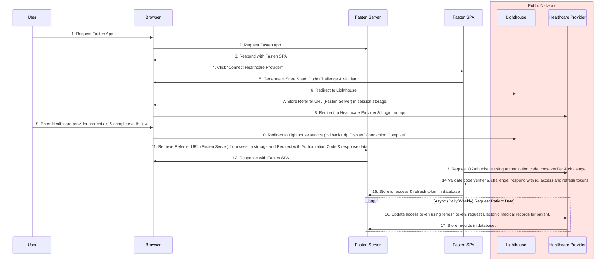

# Authentication

## Fasten Health - Smart-on-FHIR

Fasten Health leverages the [SMART-on-FHIR](https://smarthealthit.org/smart-on-fhir/) authorization 
framework to provide a secure, standards-based, and interoperable authentication and authorization mechanism for our self-hosted applications.

There are 4 actors in our authentication flow:

1. **Fasten Health (Self-Hosted Client Application)** - This is the client application that the Patient is running on their device. 
It is responsible for requesting an authorization code from the authorization server, and exchanging the authorization code 
for an access token (in most cases, see below).
1. **Healthcare Provider** - The Healthcare Provider is the server that hosts protected medical records for the Patient. 
The Healthcare Provider server is responsible for validating the access token and providing the protected records to the 
client application.
1. **Lighthouse (Auth Gateway)** - The Lighthouse server is responsible for "proxying" authentication/authorization requests 
between the Fasten Health application and the Healthcare Provider. This is required because in most environments, the 
Fasten Health application is running on a device that is not directly accessible from the internet. When the Healthcare 
Provider requires a [Confidential client](https://oauth.net/2/client-types/), the Lighthouse server is also responsible for exchanging the authorization code for an access token on behalf of the client application.
1. **Patient (User)** - The Patient is the person who is trying to access their protected medical records from their Healthcare Provider, and store them in Fasten Health.

### Security

Fasten Health leverages multiple OAuth security mechanisms to ensure that the authentication flow is secure:

1. **HTTPS** - All communication between the Fasten Health application and the Lighthouse server, and between the Lighthouse server and the Healthcare Provider, is encrypted using HTTPS.
1. **PKCE** - The [Proof Key for Code Exchange](https://oauth.net/2/pkce/) (PKCE) extension to OAuth 2.0 is used to ensure 
that the authorization code cannot be intercepted and used by a malicious attacker. This is used to ensure that the 
authentication code sent to the Lighthouse server cannot be exchanged for an access token as-is.
1. **Public Client** - The Fasten Health application acts as a [Public client](https://oauth.net/2/client-types/) when possible,
allowing the self-hosted application to communicate directly with the Healthcare Provider when exchanging an authorization code for an access token.
1. **Fragment Response Mode** - The [Fragment](https://openid.net/specs/oauth-v2-multiple-response-types-1_0.html#ResponseModes) mechanism is used to 
ensure that the authorization code is not leaked to the Lighthouse (Auth Gateway) when exchanging the authorization code for an access token. The 
fragment information is not sent to the server, and is only accessible by the client application.

#### PKCE Security Details

> The PKCE authorization code flow adds a secret (a `code_verifier` generated using SHA-256) created by the client application 
> that is verified by the authorization server. The client application creates a transform value (hash string) of the 
> `code_verifier` called the `code_challenge` which is sent using HTTPS to retrieve an authorization code. A malicious 
> attacker can intercept this code, but cannot exchange it for a token without the `code_verifier`.

The Fasten Lighthouse service acts like an redirection proxy. Even if we intend to act in a malicious manner (which we don't)
the Lighthouse only ever has access to the (temporary) `authorization_code` (not the `code_verifier`), which means the `authorization_code` cannot
be exchanged for an access token. 
Once the `authorization_code` is returned to the user, they can trade the `authorization_code` **AND** `code_verifier` for an `access_token`.

## Authentication Flow - Public Client (Preferred)

This is the preferred Self-Hosted authentication flow, leveraging Public Client OAuth security mechanism.

# References

- https://build.fhir.org/ig/HL7/smart-app-launch/scopes-and-launch-context.html
- [https://usefulangle.com/post/4/javascript-communication-parent-child-window](https://usefulangle.com/post/4/javascript-communication-parent-child-window)
- [https://build.fhir.org/ig/HL7/smart-app-launch/app-launch.html](https://build.fhir.org/ig/HL7/smart-app-launch/app-launch.html)
- [https://auth0.com/docs/flows/concepts/auth-code-pkce](https://auth0.com/docs/flows/concepts/auth-code-pkce)
- [https://build.fhir.org/ig/HL7/smart-app-launch/example-app-launch-public.html#step-5-access-token](https://build.fhir.org/ig/HL7/smart-app-launch/example-app-launch-public.html#step-5-access-token)

## Gin/Angular/JWT

- https://betterprogramming.pub/how-to-create-a-simple-web-login-using-gin-for-golang-9ac46a5b0f89
- https://dev.to/nikola/jwt-authentication-in-an-angular-application-with-a-go-backend--13cg
- https://developer.okta.com/blog/2021/02/17/building-and-securing-a-go-and-gin-web-application
- https://codewithmukesh.com/blog/jwt-authentication-in-golang/
- https://github.com/golang-jwt/jwt
