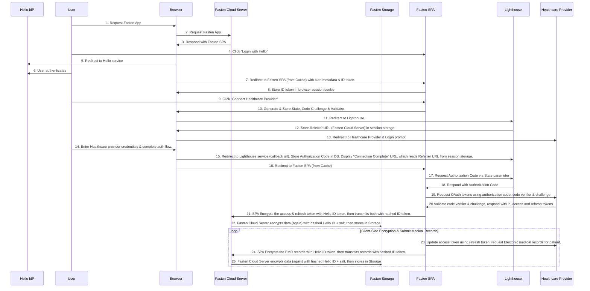

# Authentication

## OAuth/Smart-on-FHIR
- https://build.fhir.org/ig/HL7/smart-app-launch/scopes-and-launch-context.html
- [https://usefulangle.com/post/4/javascript-communication-parent-child-window](https://usefulangle.com/post/4/javascript-communication-parent-child-window)
- [https://build.fhir.org/ig/HL7/smart-app-launch/app-launch.html](https://build.fhir.org/ig/HL7/smart-app-launch/app-launch.html)
- [https://auth0.com/docs/flows/concepts/auth-code-pkce](https://auth0.com/docs/flows/concepts/auth-code-pkce)
- [https://build.fhir.org/ig/HL7/smart-app-launch/example-app-launch-public.html#step-5-access-token](https://build.fhir.org/ig/HL7/smart-app-launch/example-app-launch-public.html#step-5-access-token)
- 

> The PKCE authorization code flow adds a secret (a `code_verifier` generated using SHA-256) created by the client application that is verified by the authorization server. The client application creates a transform value (hash string) of the `code_verifier` called the `code_challenge` which is sent using HTTPS to retrieve an authorization code. A malicious attacker can intercept this code, but cannot exchange it for a token without the `code_verifier`.
> 
> https://andrewowen.net/blog/creating-diagrams-with-mermaid/

The Fasten Lighthouse service acts like a man-in-the-middle, however it only has access to the (temporary) `authroization_code` (not the `code_verifier`). The `authorization_code` is stored in the database temporarily, and returned to the user who can then trade the `authorization_code` **AND** `code_verifier` for an `access_token`.

## Gin/Angular/JWT
- https://betterprogramming.pub/how-to-create-a-simple-web-login-using-gin-for-golang-9ac46a5b0f89
- https://dev.to/nikola/jwt-authentication-in-an-angular-application-with-a-go-backend--13cg
- https://developer.okta.com/blog/2021/02/17/building-and-securing-a-go-and-gin-web-application
- https://codewithmukesh.com/blog/jwt-authentication-in-golang/
- https://github.com/golang-jwt/jwt

# Self-Hosted Redirect Based flow
This is a potential future authentication flow, primarily to make sure that mobile apps are able to work correctly. 

# Cloud Redirect Based flow
This is a potential future authentication flow, primarily to ensure that patient data can be cloud accessible, with client-side encryption (Server cannot decrypt)

