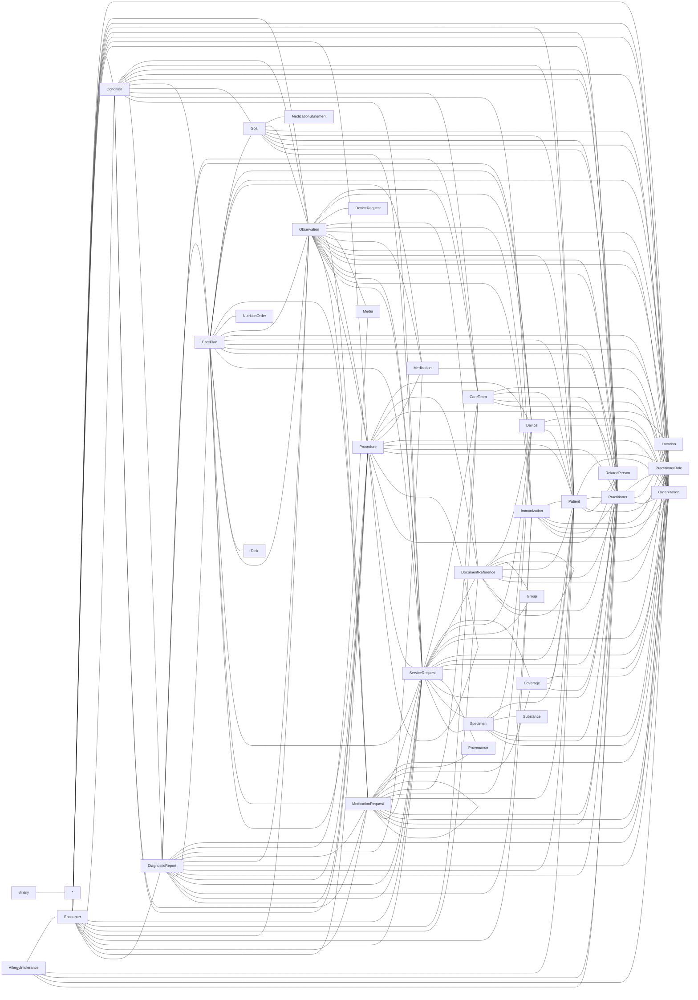

```mermaid
flowchart LR  
    AllergyIntolerance --- Encounter  
    AllergyIntolerance --- Patient  
    AllergyIntolerance --- Practitioner  
    AllergyIntolerance --- PractitionerRole  
    AllergyIntolerance --- RelatedPerson  
    Binary --- *  
    CarePlan --- Condition  
    CarePlan --- Device  
    CarePlan --- DiagnosticReport  
    CarePlan --- Goal  
    CarePlan --- Location  
    CarePlan --- Medication  
    CarePlan --- MedicationRequest  
    CarePlan --- NutritionOrder  
    CarePlan --- Observation  
    CarePlan --- Organization  
    CarePlan --- Patient  
    CarePlan --- Practitioner  
    CarePlan --- PractitionerRole  
    CarePlan --- RelatedPerson  
    CarePlan --- ServiceRequest  
    CarePlan --- Task  
    CareTeam --- Condition  
    CareTeam --- Encounter  
    CareTeam --- Organization  
    CareTeam --- Patient  
    CareTeam --- Practitioner  
    CareTeam --- PractitionerRole  
    CareTeam --- RelatedPerson  
    Condition --- DiagnosticReport  
    Condition --- Encounter  
    Condition --- Observation  
    Condition --- Patient  
    Condition --- Practitioner  
    Condition --- PractitionerRole  
    Condition --- RelatedPerson  
    Coverage --- Organization  
    Coverage --- Patient  
    Coverage --- RelatedPerson  
    Device --- Organization  
    Device --- Organization  
    Device --- Patient  
    DiagnosticReport --- CarePlan  
    DiagnosticReport --- CareTeam  
    DiagnosticReport --- Device  
    DiagnosticReport --- Encounter  
    DiagnosticReport --- Location  
    DiagnosticReport --- Media  
    DiagnosticReport --- Medication  
    DiagnosticReport --- MedicationRequest  
    DiagnosticReport --- Observation  
    DiagnosticReport --- Organization  
    DiagnosticReport --- Patient  
    DiagnosticReport --- Practitioner  
    DiagnosticReport --- Procedure  
    DiagnosticReport --- ServiceRequest  
    DocumentReference --- Device  
    DocumentReference --- DocumentReference  
    DocumentReference --- Encounter  
    DocumentReference --- Group  
    DocumentReference --- Organization  
    DocumentReference --- Patient  
    DocumentReference --- Practitioner  
    DocumentReference --- PractitionerRole  
    DocumentReference --- RelatedPerson  
    Encounter --- Condition  
    Encounter --- Location  
    Encounter --- Observation  
    Encounter --- Organization  
    Encounter --- Patient  
    Encounter --- Practitioner  
    Encounter --- PractitionerRole  
    Encounter --- Procedure  
    Encounter --- RelatedPerson  
    Encounter --- ServiceRequest  
    Goal --- Condition  
    Goal --- MedicationStatement  
    Goal --- Observation  
    Goal --- Organization  
    Goal --- Patient  
    Goal --- Practitioner  
    Goal --- PractitionerRole  
    Goal --- RelatedPerson  
    Goal --- ServiceRequest  
    Immunization --- Patient  
    Immunization --- Encounter  
    Immunization --- Location  
    Immunization --- Organization  
    Immunization --- Practitioner  
    Immunization --- PractitionerRole  
    Immunization --- Condition  
    Immunization --- Observation  
    Immunization --- DiagnosticReport  
    Medication --- Organization  
    MedicationRequest --- Organization  
    MedicationRequest --- Provenance  
    MedicationRequest --- Coverage  
    MedicationRequest --- ServiceRequest  
    MedicationRequest --- MedicationRequest  
    MedicationRequest --- CarePlan  
    MedicationRequest --- Observation  
    MedicationRequest --- Condition  
    MedicationRequest --- CareTeam  
    MedicationRequest --- Device  
    MedicationRequest --- Encounter  
    MedicationRequest --- Patient  
    MedicationRequest --- Practitioner  
    MedicationRequest --- PractitionerRole  
    MedicationRequest --- RelatedPerson  
    MedicationRequest --- Organization  
    Observation --- CarePlan  
    Observation --- CareTeam  
    Observation --- Device  
    Observation --- DeviceRequest  
    Observation --- DocumentReference  
    Observation --- Encounter  
    Observation --- Immunization  
    Observation --- Location  
    Observation --- Media  
    Observation --- Medication  
    Observation --- MedicationRequest  
    Observation --- Organization  
    Observation --- Patient  
    Observation --- Practitioner  
    Observation --- PractitionerRole  
    Observation --- Procedure  
    Observation --- RelatedPerson  
    Observation --- ServiceRequest  
    Patient --- Organization  
    Patient --- Practitioner  
    Patient --- PractitionerRole  
    Patient --- RelatedPerson  
    Practitioner --- PractitionerRole  
    Practitioner --- Location  
    Practitioner --- Organization  
    Procedure --- CarePlan  
    Procedure --- Condition  
    Procedure --- Device  
    Procedure --- DiagnosticReport  
    Procedure --- DocumentReference  
    Procedure --- Encounter  
    Procedure --- Location  
    Procedure --- Medication  
    Procedure --- Observation  
    Procedure --- Organization  
    Procedure --- Patient  
    Procedure --- Practitioner  
    Procedure --- PractitionerRole  
    Procedure --- Procedure  
    Procedure --- RelatedPerson  
    Procedure --- ServiceRequest  
    ServiceRequest --- CarePlan  
    ServiceRequest --- CareTeam  
    ServiceRequest --- Condition  
    ServiceRequest --- Coverage  
    ServiceRequest --- Device  
    ServiceRequest --- DiagnosticReport  
    ServiceRequest --- DocumentReference  
    ServiceRequest --- Encounter  
    ServiceRequest --- Group  
    ServiceRequest --- Location  
    ServiceRequest --- MedicationRequest  
    ServiceRequest --- Observation  
    ServiceRequest --- Organization  
    ServiceRequest --- Patient  
    ServiceRequest --- Practitioner  
    ServiceRequest --- PractitionerRole  
    ServiceRequest --- Provenance  
    ServiceRequest --- RelatedPerson  
    ServiceRequest --- Specimen  
    Specimen --- Patient  
    Specimen --- Device  
    Specimen --- Substance  
    Specimen --- Location  
    Specimen --- ServiceRequest  
    Specimen --- Practitioner  
    Specimen --- PractitionerRole
```
